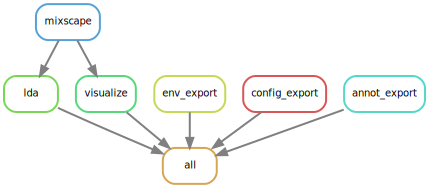

# scCRISPR-seq Perturbation Analysis Snakemake Workflow using Seurat's Mixscape
A [Snakemake](https://snakemake.readthedocs.io/en/stable/) workflow for performing perturbation analyses of pooled (multimodal) CRISPR screens with sc/snRNA-seq read-out (scCRISPR-seq) powered by the R package [Seurat's](https://satijalab.org/seurat/index.html) method [Mixscape](https://satijalab.org/seurat/articles/mixscape_vignette.html).

This workflow adheres to the module specifications of [MR.PARETO](https://github.com/epigen/mr.pareto), an effort to augment research by modularizing (biomedical) data science. For more details and modules check out the project's repository.

**If you use this workflow in a publication, please don't forget to give credit to the authors by citing it using this DOI [10.5281/zenodo.8424761](https://doi.org/10.5281/zenodo.8424761).**

Table of contents
----------------
  * [Authors](#authors)
  * [Software](#software)
  * [Methods](#methods)
  * [Features](#features)
  * [Usage](#usage)
  * [Configuration](#configuration)
  * [Example](#example)
  * [Links](#links)
  * [Publications](#publications)

# Authors
- [Stephan Reichl](https://github.com/sreichl)
- [Christoph Bock](https://github.com/chrbock)

# Software
This project wouldn't be possible without the following software and it's dependencies:

| Software       | Reference (DOI)                                   |
| :------------: | :-----------------------------------------------: |
| ggplot2        | https://ggplot2.tidyverse.org/                    |
| Mixscape       | https://doi.org/10.1038/s41588-021-00778-2        |
| mixtools       | https://CRAN.R-project.org/package=mixtools       |
| patchwork      | https://CRAN.R-project.org/package=patchwork      |
| Seurat         | https://doi.org/10.1016/j.cell.2021.04.048        |
| Snakemake      | https://doi.org/10.12688/f1000research.29032.2    |

# Methods
This is a template for the Methods section of a scientific publication and is intended to serve as a starting point. Only retain paragraphs relevant to your analysis. References [ref] to the respective publications are curated in the software table above. Versions (ver) have to be read out from the respective conda environment specifications (.yaml file) or post execution. Parameters that have to be adapted depending on the data or workflow configurations are denoted in squared brackets e.g. [X].

The outlined analyses were performed using the R package Seurat (ver) [ref] unless stated otherwise.

**Mixscape**. We applied the Mixscape workflow [ref], implemented in Seurat, on each [sample] separately as well as all [samples] simultaneously to identify perturbed cells compared to non-targeting (NT) guide RNA (gRNA) assigned cells. Briefly, cells putatively assigned to a gRNA and respective knockout (KO) target gene in conjunction with NT cells were used to calculate cell-wise perturbation signatures by using Seurat::CalcPerturbSig to subtract the average expression profile of  the [n_neighbors] closest NT cells in [ndims]-dimensional PCA space. Using Seurat::RunMixscape, with a log2(fold change) threshold of [lfc_th] and a minimum of [min_de_genes] differentially expressed genes, cells were classified as perturbed or non-perturbed using posterior probabilities of an expectation-maximization (EM) algorithm for mixtures of univariate normals, assuming each putatively annotated target gene group is a mixture of two Gaussian distributions (perturbed signal and non-perturbed background). 

**Visualizations**. Statistics of the Mixscape classification of perturbed cells versus cells with no detectable perturbation on a target gene and gRNA basis using barplots. Perturbation scores of cells split by their Mixscape classification as density plots. Posterior probability values of non-perturbed and perturbed cells as violin plots using the Seurat function VlnPlot. Perturbation scores and posterior probabilities were additionally plotted split by replicates [split_by_col] and experiment conditions [split_by_col]. For the visualization of protein surface expression measured by Antibody Capture technologies the Seurat function VlnPlot for violin plots split by perturbation classification of cells was used.

**Linear discriminant analysis (LDA)**. LDA was applied on the perturbation signatures of all perturbed and NT cells using Seurat::MixscapeLDA with number of principal components [npcs] per KO class to find the most discriminative subspace, given the KO/NT classes, to project the data into and visualized in two dimensions using UMAP with Seurat::RunUMAP.

**The analysis and visualizations described here were performed using a publicly available Snakemake [ver] (ref) workflow [10.5281/zenodo.8424761](https://doi.org/10.5281/zenodo.8424761).**

# Features
The workflow performs all steps of the [Mixscape Vignette](https://satijalab.org/seurat/articles/mixscape_vignette.html) on all samples in the annotation file according to the parametrization in the config file.
- Calculation of local perturbation signatures
  - all and filtered (=pertubed-only) perturbation (PRTB) signatures (CSV)
- Mixscape classification of perturbed cells versus cells with no detectable perturbation
- Visualization of Mixscape results
  - Statistics of the Mixscape classification on a target gene and guide RNA basis (Bar plots)
  - Perturbation scores of cells split by their mixscape classification (Density plots)
  - Posterior probability values in non perturbed and perturbed cells (Violin plots)
  - if Antibody Capture was used: Surface protein expression measurements split by perturbation classification of cells (Violin plots)
- Analysis of perturbation responses with Linear Discriminant Analysis (LDA)
  - LDA components (CSV)
  - Visualization using UMAP

# Usage
Read the [Mixscape Vignette](https://satijalab.org/seurat/articles/mixscape_vignette.html).

# Configuration
Detailed specifications can be found here [./config/README.md](./config/README.md)

# Example
--- COMING SOON ---

# Links
- [GitHub Repository](https://github.com/epigen/mixscape_seurat/)
- [GitHub Page](https://epigen.github.io/mixscape_seurat/)
- [Zenodo Repository](https://doi.org/10.5281/zenodo.8424761)
- [Snakemake Workflow Catalog Entry](https://snakemake.github.io/snakemake-workflow-catalog?usage=epigen/mixscape_seurat)

# Publications
The following publications successfully used this module for their analyses.
- ...